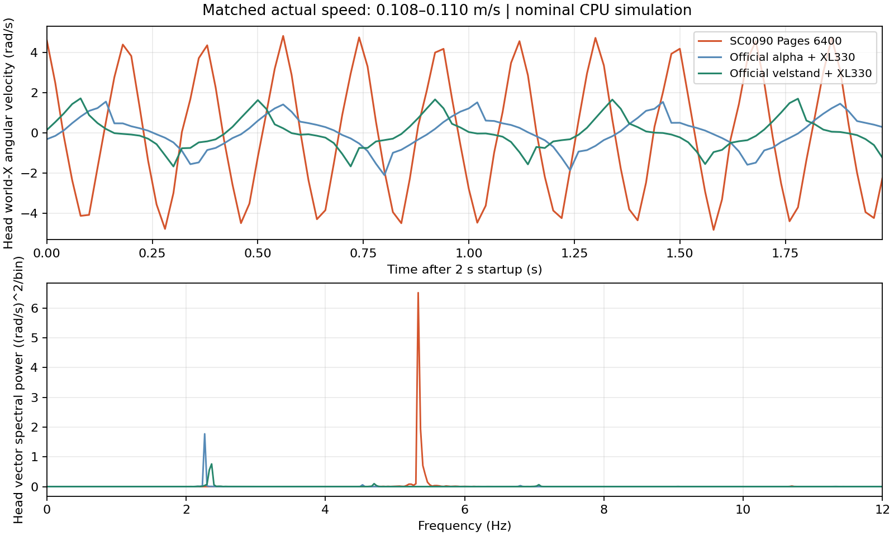

# 官方 Microduck 与 SC0090 Pages 的步态量化对照

测量日期：2026-09-15。结论适用于本文的固定参数 CPU 仿真，不是实机测量。

## 主要结果

在实际前进速度都约 **0.11 m/s** 时，Pages checkpoint 6400 相比官方新默认
`velstand`：两脚合计落脚频率为 **2.29 倍**，同脚跨步距离为 **46%**，头部世界
角速度 RMS 为 **2.37 倍**，头部角加速度 RMS 为 **3.70 倍**。
因此，这组对照支持“我们的碎步、头部高频抖动明显更重”，不能用“官方也会摆头”解释掉差距。

每条轨迹运行 32 秒，主表统计第 2–32 秒；没有推扰、随机化、自动重置或起身策略切换。
三者实际速度最大差距约 2.2%，Pages 与新官方模型的差距约 1.3%。

| 测量项 | SC0090 Pages 6400 | 官方旧版 alpha | 官方新版 velstand |
| --- | ---: | ---: | ---: |
| 输入前进指令（m/s） | 0.110 | 0.275 | 0.300 |
| 实际前进速度（m/s） | 0.1101 | 0.1077 | 0.1087 |
| 两脚合计落脚频率（次/秒） | 10.67 | 4.50 | 4.67 |
| 同脚跨步距离中位数（mm） | 20.5 | 45.4 | 44.8 |
| 腾空时间中位数（秒） | 0.08 | 0.22 | 0.20 |
| 头部世界角速度 RMS（rad/s） | 3.30 | 1.43 | 1.39 |
| 头部角加速度 RMS（rad/s²） | 116.6 | 28.7 | 31.5 |
| 头部角速度主频（Hz） | 5.33 | 2.27 | 2.37 |
| 身体世界角速度 RMS（rad/s） | 0.694 | 0.939 | 0.960 |
| 头部相对身体角速度 RMS（rad/s） | 2.738 | 0.863 | 1.009 |
| 本条 32 秒轨迹触发跌倒判据 | 否 | 否 | 否 |

“同脚跨步”是同一只脚两次落地间的前进距离，不是左右脚交替的一步。
“落脚频率”是两脚之和，不是单脚周期。头部角速度主频来自世界坐标三轴信号的总频谱。
头部相对身体角速度由同一世界坐标下两者角速度向量之差计算。

还有一个有用的区别：Pages 的身体角速度反而小于官方，但头部相对身体的角速度更大。
这提示头颈协调值得优先检查；仅进一步锁紧身体姿态，未必能解决头抖。
这不是因果证明，仍需独立改变头颈约束来检验。



上图上半部分展示测量窗口开始后的 2 秒世界 X 轴角速度，下半部分使用完整 30 秒的
三轴频谱。每个频率格的功率按采样数归一化，未对不同模型分别归一到相同峰值。

## 相同指令下的结果必须同时报告

调节指令匹配实际速度，是为了比较观感；它不能隐藏速度跟踪差异。以下使用相同指令，
仍统计第 2–32 秒的实际前进速度：

| 输入指令（m/s） | Pages 6400（m/s） | 官方 alpha（m/s） | 官方 velstand（m/s） |
| --- | ---: | ---: | ---: |
| 0.08 | 0.0780 | 约 0 | 约 0 |
| 0.10 | 0.0995 | 约 0 | 约 0 |
| 0.20 | 0.2001 | 约 0 | 约 0 |
| 0.30 | 0.2984 | 0.1203 | 0.1087 |

在这里的 HOME 初始化和固定参数下，两版官方策略在前三个指令点没有持续迈步。
不能把这些站立状态下很小的头部 RMS 当作“更平滑的行走”。这也不是对官方实机最低
速度的测定：动力学实现、延迟、初始状态和部署处理都可能影响是否起步。

补充指令扫描覆盖 0.25、0.275、0.30、0.325、0.35、0.40 m/s，每点先测 12 秒。
据此选择了上表的实际速度接近点，再延长到 32 秒。完整扫描及未起步结果均保留在
[机器可读结果](measurements/sc0090-official-gait-2026-09-15.json)，没有只保存表现好的点。

## 模型、物理与部署处理

官方模型来自 [Pollen Robotics 的策略库](https://huggingface.co/pollen-robotics/microduck-policies/tree/1b56c396825c052a4e26e95cf2b8d8298af9e9b4)。
其 manifest 把 `velstand.onnx` 标为 v5 起的默认行走策略，同时保留 `alpha_walking.onnx`。
两者导出元数据均为 61 维观测、14 维动作和动作缩放 1；观测包含归一化处理。

| 项目 | Pages 6400 | 官方 alpha / velstand |
| --- | --- | --- |
| 电机模型 | 当前辨识的 SC0090 M6 | 官方训练依赖锁定的 XL330 M6 |
| 供电 / 固件 P 增益 | 12 V / 20 | 7.4 V / 200 |
| 供电压降 | 现有 Pages 的 0.1 Ω 模型 | 固定电压，无压降 |
| 碰撞模型 | `scene.xml` / groundcontact | alpha 用 walk；velstand 用 allcollisions |
| 主要对照的动作缩放、输出滤波 | 1 / 无 | 1 / 无 |
| 关节速度观测 | 延迟一个 20 ms 控制周期 | 延迟一个 20 ms 控制周期 |

官方电机参数固定为 BAM `62bd8ce12154340be97e06f7f41a0ca8f116d967` 的
[`bam/params/xl330/m6.json`](https://github.com/Rhoban/bam/blob/62bd8ce12154340be97e06f7f41a0ca8f116d967/bam/params/xl330/m6.json)，
与官方 `develop`、`protective_fall` 的依赖锁一致。不能直接使用当前安装版本的同名
XL330 文件：其阻值、转矩常数、摩擦参数等已变化。本次发现差异后用锁定参数重跑，
本文仅采用锁定参数的结果。

机器人 XML 与官方 `develop` commit `cb70b792312d559a4da09064d92009079671815f`
核对无本地修改；所用 allcollisions XML 与本地官方 `protective_fall` 引用也一致。
原始文件、模型、关键参数文件的 SHA-256 保存在结果中。

执行统一使用现有修正后的 CPU BAM 摩擦计算、MuJoCo 200 Hz、策略 50 Hz，
`implicitfast`、10 次求解迭代、20 次线搜索、脚底摩擦系数 1。
本对照不恢复已知的 CPU 摩擦 DOF 索引错误，也不重演旧 GPU 摩擦实现。
不增加额外动作延迟、不施加域随机化；它是固定条件下的策略与电机组合比较，
不能单独归因于奖励、电机或某次物理修复。

另测了 `velstand` 叠加部署文档所列的动作缩放 0.9、头部输出混合系数 0.5、腿部 0.7。
这只是三项输出处理的敏感性试验，没有复刻整个 daemon。在 0.30 m/s 指令下，
它起步明显变晚：第 2–12 秒几乎未前进，第 22–32 秒约 0.0989 m/s。
因此没有拿它起步前的低抖动数据来宣传滤波收益，也没有把该配置应用到 SC0090。

## 测量检查与复测

- 新测量器与 Pages `Demo` 在连续 150 个控制步内，关节位置、速度和策略动作逐项完全相等。
  重复读取测量状态不推进观测历史。该检查已保存为回归测试。
- 既有步态单位、CPU BAM 摩擦及加载检查共 8 项通过；新增执行一致性检查 1 项通过。
- 所有正式测量轨迹有限值检查通过。跌倒定义与 Pages 一致：身体高度低于 0.08 m，
  或倾角超过 45°；触发后不会隐藏失败或切换专家。
- 头部角速度由 `mj_objectVelocity` 的世界坐标输出获得；角加速度由 20 ms 差分估计。
  超过 25 Hz 的运动不在这组采样的可辨识范围内。
- 落脚使用正的脚底法向接触力；此前腾空、此后接触各至少持续两个样本。
  这是统一的检测口径，不是生物学上的步态定义。

主表使用完整 30 秒统计，另外保留三个连续 10 秒窗口观察变化。比如新官方模型的头部
RMS 为 1.386–1.399 rad/s，Pages 为 3.298–3.305 rad/s。三个窗口来自同一条轨迹，
不能当成三个独立种子或统计置信区间。全窗口与分窗口的落脚频率也会因边缘事件排除略有差别。

脚本：[`simulator/scripts/compare_official_gait.py`](../simulator/scripts/compare_official_gait.py)。
本机原始轨迹、配置、下载参数和完整日志位于
`logs/sc0090_setup/official_gait_comparison/`，目录由 git 忽略。
参数文件显式给出政策文件、场景、电机文件和哈希、供电与输出处理；路径按运行目录解释。

```bash
uv run python simulator/scripts/compare_official_gait.py \
  --profiles logs/sc0090_setup/official_gait_comparison/profiles.json \
  --output-dir logs/sc0090_setup/official_gait_comparison/recheck
```

这些数据支持下一轮同时关注较完整的摆腿和头颈协调。官方的频率可以作为对照参考，
不能未经本机动力学可行性检查就硬设为 SC0090 的目标值。Pages 目前仍展示原有 6400 视频。
